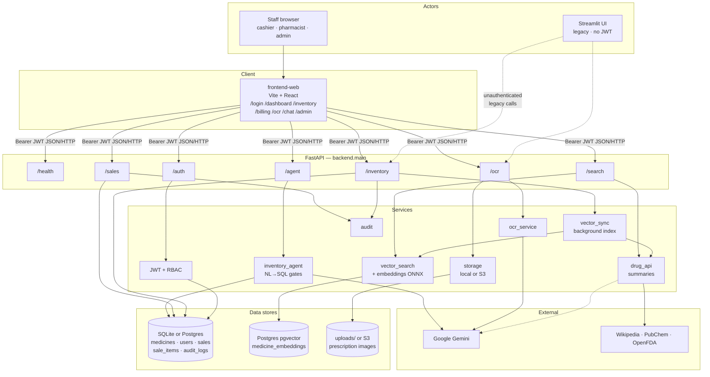
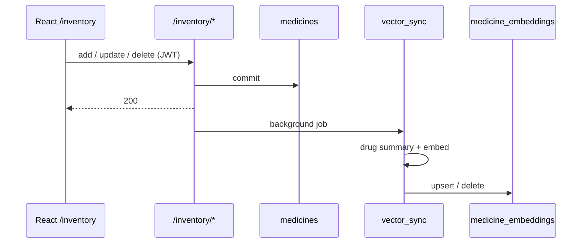
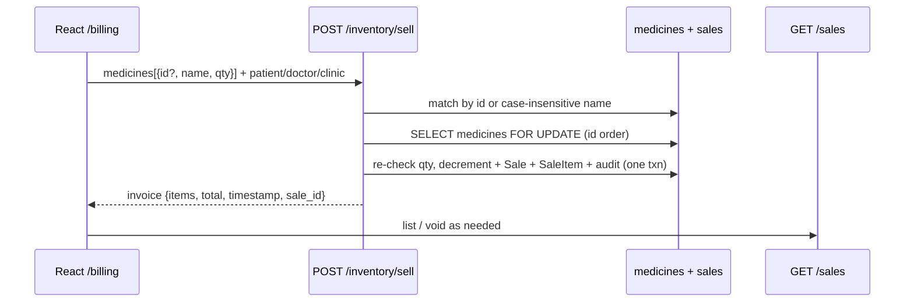
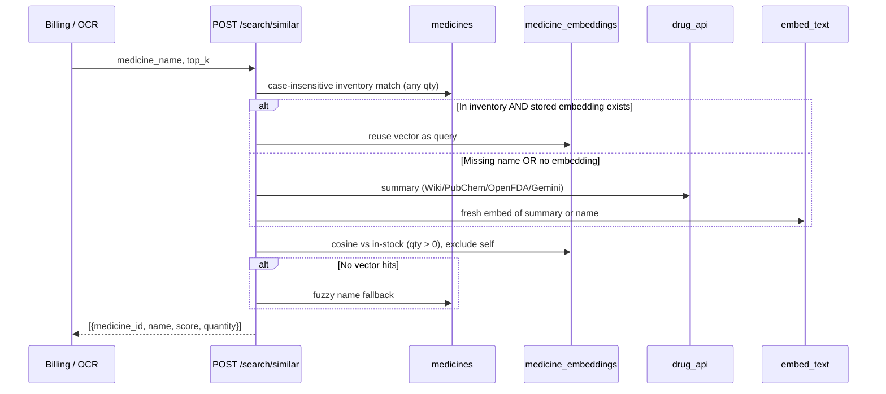
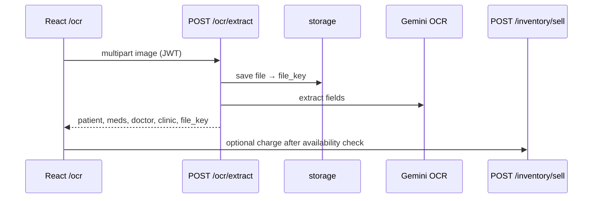
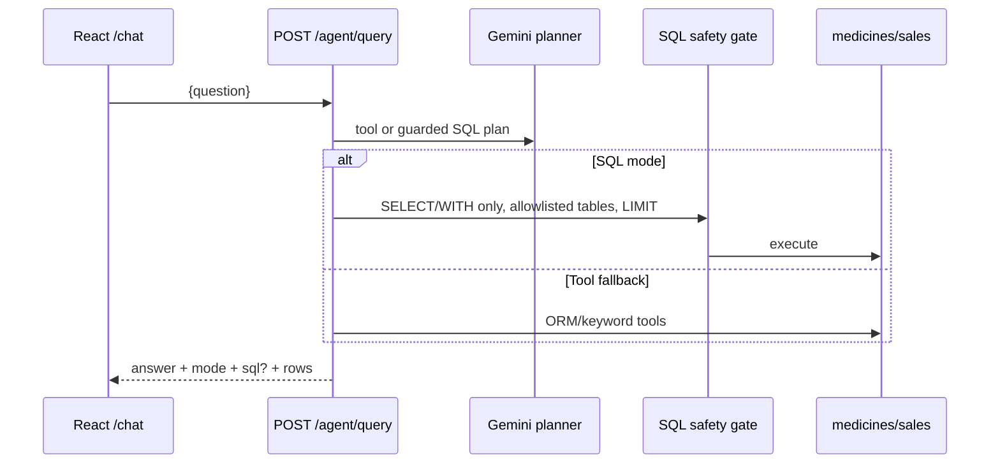

# System architecture

PharmaAssist is a pharmacy operations stack: **React staff UI** → **FastAPI** →
**SQL inventory / sales / auth**, with **pgvector** similar-search, **Gemini** OCR
& chat planning, and optional **S3** prescription storage.

For env vars see [environment.md](environment.md). For deploy see [deployment.md](deployment.md).

## System overview



## Layers (code map)

```text
frontend-web/            React staff app (primary UI)
frontend/                Streamlit UI (legacy; no JWT)
backend/main.py          FastAPI app, CORS, router mount, lifespan bootstrap
backend/api/             Thin HTTP routers
backend/schemas/         Pydantic request/response models
backend/services/        Business logic (search, OCR, agent, storage, audit, …)
backend/db/              SQLAlchemy engine, sessions, ORM models
backend/core/            Config, JWT, deps, roles, errors
scripts/                 init_db, reindex, smoke helpers
```

## Data stores

| Store | Role | Config |
|-------|------|--------|
| SQLite (`pharma.db`) or Postgres | Source of truth: inventory, users, sales, audit | `DATABASE_URL` (default SQLite) |
| Postgres `medicine_embeddings` (pgvector) | Similar-medicine vectors (384-d MiniLM) | Requires PostgreSQL `DATABASE_URL` |
| Local `uploads/` or S3 | Prescription images from OCR | `STORAGE_BACKEND` |

On **SQLite**, vector upserts are no-ops; `/search/similar` falls back to fuzzy name matching when vectors are empty.

## Dual-write: SQL inventory ↔ pgvector

On **add**, **update**, and **delete**:

1. Commit SQL first (inventory is source of truth).
2. Queue drug-summary fetch + embedding upsert/delete on a background worker (`vector_sync`).
3. On SQLite, vector steps are no-ops.

**Sell** only changes SQL quantities (and writes `sales` / `sale_items`) in one transaction. Embeddings are unchanged (they store semantic text, not stock). Stock 0/low does **not** recompute embeddings — quantity is a search filter only.

Stock mutations take **pessimistic row locks** (`SELECT … FOR UPDATE`, refresh ORM via `populate_existing`):

- **Sell** — lock every cart medicine in `id` order, then re-check quantity (so two cashiers cannot both take the last unit).
- **Void** — lock the sale row first (blocks double-void), then lock medicines in `id` order before restoring qty.
- **Update / delete** — lock the medicine row so a concurrent sell cannot lose its decrement.

SQLite ignores `FOR UPDATE`; production Postgres enforces it. Locking by sorted `id` avoids multi-item deadlocks.

| Outcome | Behavior |
|---------|----------|
| SQL commit fails | Request fails |
| SQL OK, embedding fails later | Inventory kept; failure logged; HTTP still 200 |
| Both OK | Normal 200 |

Repair search with `POST /search/reindex`. Set `VECTOR_SYNC_INLINE=1` in tests.

---

## Major request flows

### 1. Login

```mermaid
sequenceDiagram
  participant UI as React /login
  participant API as POST /auth/login
  participant DB as users

  UI->>API: email + password
  API->>DB: verify hash
  API->>DB: store hashed refresh token
  API-->>UI: access_token + Set-Cookie (httpOnly refresh)
  Note over UI: Access JWT in memory; refresh cookie used on /auth/refresh
```

### 2. Inventory CRUD + index



### 3. Sell / invoice



### 4. Similar search (alternatives)



### 5. OCR → review → sell



### 6. Inventory chat agent



### 7. Reindex

`POST /search/reindex` (pharmacist/admin) rebuilds embeddings for all medicines via background jobs. See [vector-search.md](vector-search.md).

---

## API surface

| Prefix | Purpose |
|--------|---------|
| `GET /`, `/health/live`, `/health/ready` | Liveness / readiness |
| `/auth` | Login, refresh, logout, me, users, register, audit |
| `/inventory` | CRUD, low-stock, **sell** |
| `/sales` | Summary, history, void |
| `/search` | Similar, reindex |
| `/ocr` | Prescription extract |
| `/agent` | NL inventory chat |

### Contract highlights

| Method | Path | Notes |
|--------|------|--------|
| POST | `/auth/login` | → `{ access_token, expires_in, user }` + httpOnly refresh cookie |
| POST | `/auth/refresh` | Cookie → new access JWT; rotates refresh cookie |
| POST | `/auth/logout` | Revokes refresh token and clears cookie |
| GET | `/inventory/?page&limit&q…` | Paginated list |
| GET | `/inventory/all` | Full list (compat) |
| POST | `/inventory/sell` | `{ medicines: [{ id?, name, quantity }], patient?, doctor?, clinic? }` → invoice |
| GET | `/sales/`, `/sales/summary`, `POST /sales/{id}/void` | History / metrics / void |
| POST | `/search/similar` | → `[{ medicine_id, name, score, quantity? }]` |
| POST | `/search/reindex` | Pharmacist+ |
| POST | `/ocr/extract` | Multipart → JSON + `file_key` |
| POST | `/agent/query` | `{ question }` → answer + plan metadata |

Schemas live under `backend/schemas/`. Auth details: [auth.md](auth.md). Agent gates: [inventory-agent.md](inventory-agent.md).

## Testing

See [testing.md](testing.md). Prefer pytest; use temp `DATABASE_URL` never production DB.
